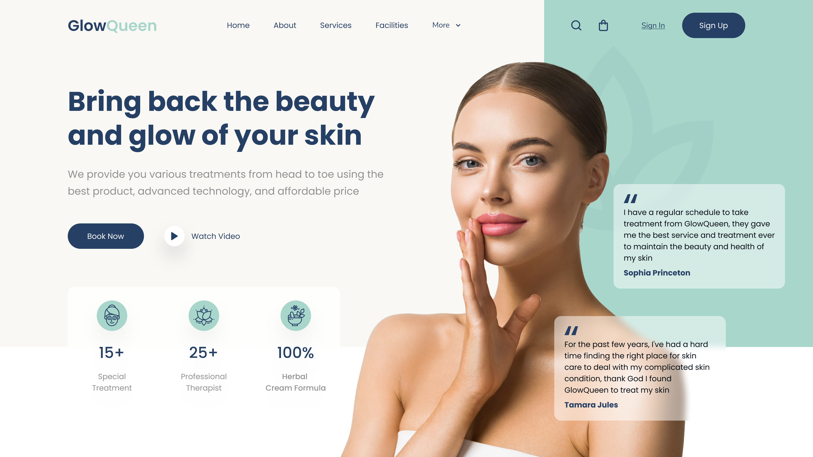

# HTML-SASS Header Spa & Beauty

## Descripción del proyecto :memo:

En este proyecto encontrarás el encabezado del centro de belleza ficticio <b><i>"GlowQueen"</i></b>, una plataforma que garantiza productos naturales, tecnología avanzada y terapeutas altamente cualificados. El diseño utiliza las siguientes tecnologías:

- <b>HTML:</b> Estructura básica de la página y contenido.
- <b>CSS:</b> Para configurar el diseño visual del contenido.
- <b>Sass:</b> Preprocesador CSS para crear estilos modulares y mantenibles.
- <b>Vite:</b> Herramienta de desarrollo web de alta velocidad para una experiencia de desarrollo más rápida.

## Vista previa del diseño :clipboard:

En la siguiente imagen se aprecia un detalle del resultado obtenido:

> [!WARNING]
> Este encabezado está diseñado para ofrecer una experiencia visual óptima en pantallas con una resolución mínima de 1200px. De este modo se garantiza que los elementos visuales y la disposición del contenido se presenten de manera atractiva y efectiva en pantallas de este tamaño. 🖥️

## Uso :point_left:

Puedes reutilizar el código para tu propio proyecto web. Simplemente descárgate el repositorio y añádele los cambios necesarios para integrarlo en tu sitio.

## Contribuciones :information_desk_person:

¡Se aceptan contribuciones, claro que sí! Si encuentras algún problema o tienes alguna sugerencia de mejora, no dudes en ponerte en contacto conmigo y aportar tus ideas. Te lo agradeceré infinitamente :handshake:

